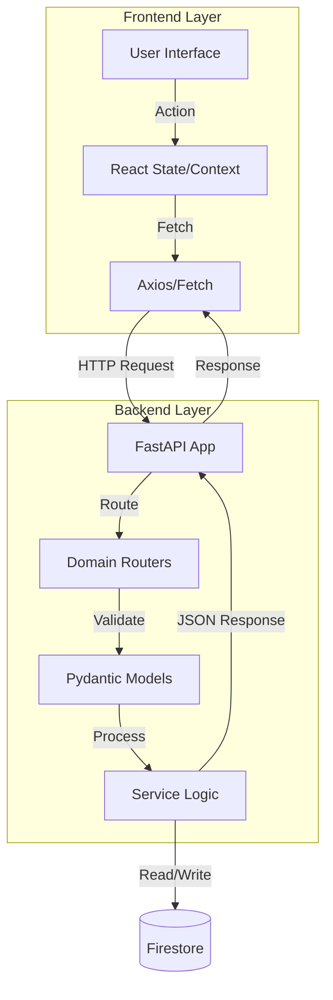

# Portfolio System

A modern, full-stack portfolio platform built with **React** (Frontend) and **FastAPI** (Backend). Designed for high-performance project showcases, technical writing, and dynamic content management.

## Features

- **Dynamic Content**:
  - **Achievements & Badges**: Gamified showcase of professional milestones.
  - **Personality Archetype**: Visual representation of "The Human Design" (MBTI/Interests).
  - **Quote System**: Featured personal quotes.
- **Admin Dashboard**: Secured interface to manage projects, writings, and system configurations (`/admin`).
- **Project Showcases**: Detailed case studies with automatic **Mermaid.js** diagram rendering for HLD/LLD.
- **Arena**: A playground for coding challenges and public discourse (`/arena`). (currently under development)
- **Systems & Vault**: Documentation of engineering philosophy and mental models.
- **Authentication**: Secure login/signup system via **Firebase Auth**.
- **Responsive Design**: Premium mobile-first UI using Tailwind CSS with glassmorphism aesthetics.
- **AI Integration**: Routes for AI-powered content explanation and analysis.

## Tech Stack

### Frontend
- **Framework**: [React](https://react.dev/) + [Vite](https://vitejs.dev/)
- **Styling**: [Tailwind CSS](https://tailwindcss.com/)
- **Visualization**: [Mermaid.js](https://mermaid.js.org/) (Architecture Diagrams)
- **Icons**: [Lucide React](https://lucide.dev/)
- **Routing**: [React Router](https://reactrouter.com/)

### Backend
- **Framework**: [FastAPI](https://fastapi.tiangolo.com/)
- **Runtime**: Python 3.10+
- **Database**: [Firebase Firestore](https://firebase.google.com/docs/firestore) (NoSQL)
- **Authentication**: Firebase Admin SDK
- **Rate Limiting**: SlowAPI
- **Server**: Uvicorn

### Infrastructure
- **Storage**: Google Cloud Storage (via Firebase)
- **Deployment**: Google Cloud Run (Backend and Frontend)

## Getting Started

### Prerequisites

- Node.js (v18 or higher)
- Python (v3.10 or higher)
- npm or yarn
- **Firebase Service Account**: You need a `serviceAccountKey.json` from your Firebase Console.

## System Architecture

### High-Level Design (HLD)

The system follows a moduler **Client-Server Architecture** designed for scalability and clear separation of concerns.

- **Client (Frontend)**: A Single Page Application (SPA) built with React and Vite. It handles all UI/UX interactions, client-side routing, and state management. It communicates with the backend via RESTful APIs.
- **Server (Backend)**: A high-performance asynchronous REST API built with FastAPI. It handles business logic, data processing, and serves as the interface between the client and data storage/external services.
- **Storage**:
  - **Google Cloud Storage (GCS)**: Stores static assets (images, project media) for low-latency global delivery.
  - **Firestore**: structured NoSQL database for user profiles, project metadata, and content.

### Data Flow

## Architecture Decisions

| Decision | Context | Justification |
| :--- | :--- | :--- |
| **Vite over CRA** | Build Tooling | Vite offers significantly faster cold starts and HMR (Hot Module Replacement) compared to Webpack/CRA, improving developer velocity. |
| **Tailwind CSS** | Styling | Reduces CSS bundle size and enforces design consistency via utility classes vs. BEM/SASS methodology. |
| **FastAPI** | Backend Framework | Chosen for native async support (high concurrency) and automatic OpenAPI (Swagger) documentation generation. |
| **Firestore** | Database | Flexible NoSQL schema allows for rapid iteration of content models (projects, blogs) without complex migrations. |

## Failure Points & Mitigations

| Failure Point | Risk Level | Detection | Mitigation Strategy |
| :--- | :--- | :--- | :--- |
| **Frontend-Backend Disconnect** | High | API request timeouts / 5xx errors | **Error Boundaries**: display user-friendly fallback UI. **Retry Logic**: Exponential backoff on critical fetch requests. |
| **GCS Asset Unavailability** | Medium | Broken image links (404) | **Skeleton Loaders** & **Fallback Images**: styling overrides to prevent layout shifts. |
| **API Rate Limiting** | Low | HTTP 429 Responses | **Caching**: Implement browser-side caching (TanStack Query/SWR) to reduce frequent server calls. |
| **Deployment Sync** | Medium | Version mismatch | **Semantic Versioning**: API versioning (e.g., `/api/v1/`) to support breaking changes without disrupting live clients. |
