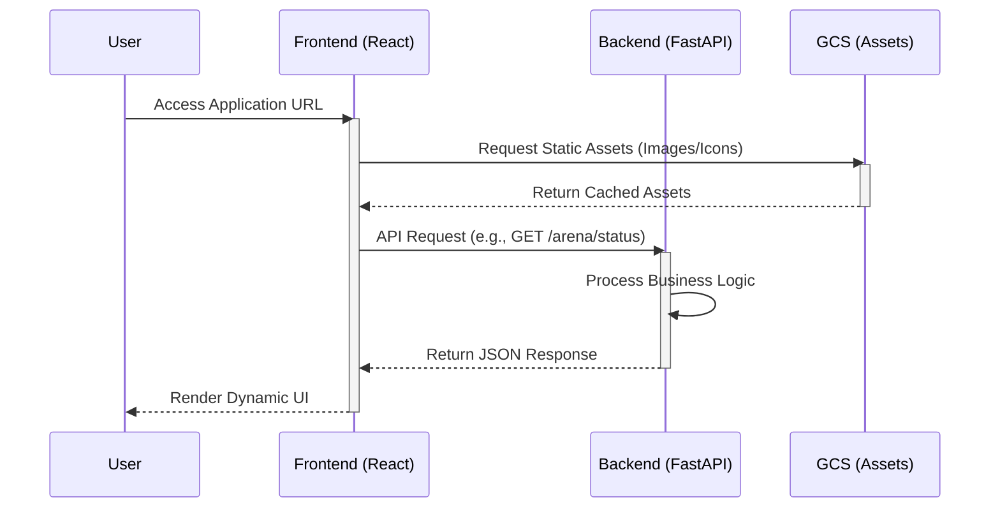
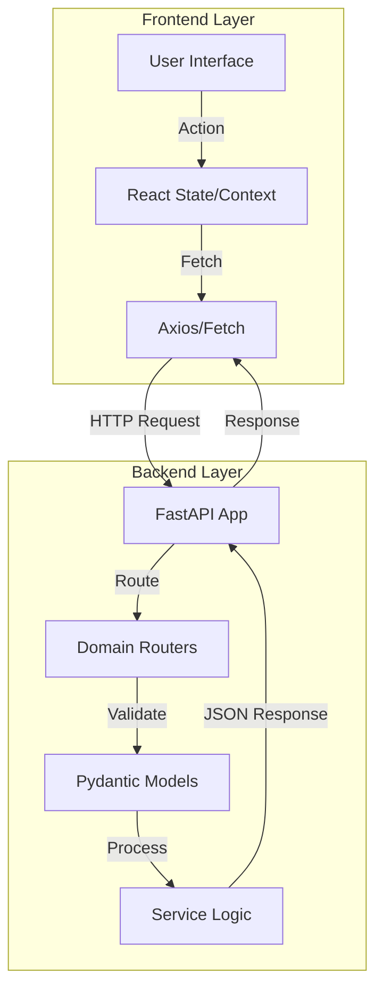

# Portfolio System

A modern, full-stack portfolio platform built with **React** (Frontend) and **FastAPI** (Backend). Designed for high-performance project showcases, technical writing, and dynamic content management.

## Features

- **Dynamic Content**:
  - **Achievements & Badges**: Gamified showcase of professional milestones.
  - **Personality Archetype**: Visual representation of "The Human Design" (MBTI/Interests).
  - **Quote System**: Featured personal quotes.
- **Project Showcases**: Detailed case studies (`/projects`).
- **Arena**: A playground for coding challenges and public discourse (`/arena`).
- **Systems & Vault**: Documentation of engineering philosophy and mental models.
- **Authentication**: Secure login/signup system.
- **Responsive Design**: Premium mobile-first UI using Tailwind CSS.

## Tech Stack

### Frontend
- **Framework**: [React](https://react.dev/) + [Vite](https://vitejs.dev/)
- **Styling**: [Tailwind CSS](https://tailwindcss.com/)
- **Icons**: [Lucide React](https://lucide.dev/)
- **Routing**: [React Router](https://reactrouter.com/)

### Backend
- **Framework**: [FastAPI](https://fastapi.tiangolo.com/)
- **Runtime**: Python 3.10+
- **Server**: Uvicorn

## Getting Started

### Prerequisites

- Node.js (v18 or higher)
- Python (v3.10 or higher)
- npm or yarn

### Installation

Clone the repository:
```bash
git clone https://github.com/Developer-Sahil/portfolio-system.git
cd portfolio-system
```

#### 1. Frontend Setup

Navigate to the frontend directory and install dependencies:
```bash
cd app/frontend
npm install
```

Start the frontend development server:
```bash
npm run dev
```
The frontend will be available at [http://localhost:5173](http://localhost:5173).

#### 2. Backend Setup

Open a new terminal, navigate to the backend directory:
```bash
cd app/backend
```

Create and activate a virtual environment:
```bash
# Windows
python -m venv venv
venv\Scripts\activate

# macOS/Linux
python3 -m venv venv
source venv/bin/activate
```

Install Python dependencies:
```bash
pip install -r requirements.txt
```

Start the backend server:
```bash
uvicorn main:app --reload
```
The backend API will run at [http://localhost:8000](http://localhost:8000). API docs are available at `/docs`.

## Project Structure

```
c:/dev/portfolio-system/
├── app/
│   ├── frontend/          # React Frontend application
│   │   ├── public/
│   │   ├── src/
│   │   │   ├── components/
│   │   │   ├── pages/     # Home, Projects, Arena, etc.
│   │   │   └── ...
│   │   └── ...config files
│   │
│   └── backend/           # FastAPI Backend application
│       ├── app/
│       │   ├── routers/   # API functionalities (arena, etc.)
│       │   └── ...
│       ├── main.py        # Entry point
│       ├── requirements.txt
│       └── ...
├── docs/                 # Documentation & Guides
├── .gitignore
└── README.md
```

## System Architecture

### High-Level Design (HLD)

The system follows a moduler **Client-Server Architecture** designed for scalability and clear separation of concerns.

- **Client (Frontend)**: A Single Page Application (SPA) built with React and Vite. It handles all UI/UX interactions, client-side routing, and state management. It communicates with the backend via RESTful APIs.
- **Server (Backend)**: A high-performance asynchronous REST API built with FastAPI. It handles business logic, data processing, and serves as the interface between the client and data storage/external services.
- **Storage**:
  - **Google Cloud Storage (GCS)**: Stores static assets (images, project media) for low-latency global delivery.
  - **Database (Planned)**: Structured data storage for user profiles, project metadata, and arena threads.

### Low-Level Design (LLD)

#### Frontend (React + Vite)
- **Component Hierarchy**: Uses Atomic Design principles (atoms -> molecules -> organisms -> templates).
  - `components/ui`: Base Radix-like primitives (buttons, inputs).
  - `pages`: Logical route handlers (Home, Projects, Arena).
- **Styling**: Utility-first CSS using **Tailwind CSS**. Theme configuration lies in `tailwind.config.js` for consistent colors/spacing.
- **State Management**: React Context/Hooks for local UI state.

#### Backend (FastAPI)
- **Application Factory**: `main.py` entry point initializes the app with CORS middleware and global exception handlers.
- **Routing Pattern**: Modular routers (`app/routers/`) separate logic by domain (e.g., `arena.py` for community features).
- **Data Validation**: **Pydantic** models ensure strong typing and automatic request/response validation.

### Process Flows

#### 1. End-to-End Request Flow
This sequence demonstrates how the Frontend, Backend, and GCS interact during a typical user session.



#### 2. Data Flow Architecture
A high-level view of how data moves through the application layers.




## Architecture Decisions

| Decision | Context | Justification |
| :--- | :--- | :--- |
| **Vite over CRA** | Build Tooling | Vite offers significantly faster cold starts and HMR (Hot Module Replacement) compared to Webpack/CRA, improving developer velocity. |
| **Tailwind CSS** | Styling | Reduces CSS bundle size and enforces design consistency via utility classes vs. BEM/SASS methodology. |
| **FastAPI** | Backend Framework | Chosen for native async support (high concurrency) and automatic OpenAPI (Swagger) documentation generation. |
| **Google Cloud Storage** | Asset Storage | Offloads heavy media serving from the application server, ensuring better performance and scalability. |

## Failure Points & Mitigations

| Failure Point | Risk Level | Detection | Mitigation Strategy |
| :--- | :--- | :--- | :--- |
| **Frontend-Backend Disconnect** | High | API request timeouts / 5xx errors | **Error Boundaries**: display user-friendly fallback UI. **Retry Logic**: Exponential backoff on critical fetch requests. |
| **GCS Asset Unavailability** | Medium | Broken image links (404) | **Skeleton Loaders** & **Fallback Images**: styling overrides to prevent layout shifts. |
| **API Rate Limiting** | Low | HTTP 429 Responses | **Caching**: Implement browser-side caching (TanStack Query/SWR) to reduce frequent server calls. |
| **Deployment Sync** | Medium | Version mismatch | **Semantic Versioning**: API versioning (e.g., `/api/v1/`) to support breaking changes without disrupting live clients. |
